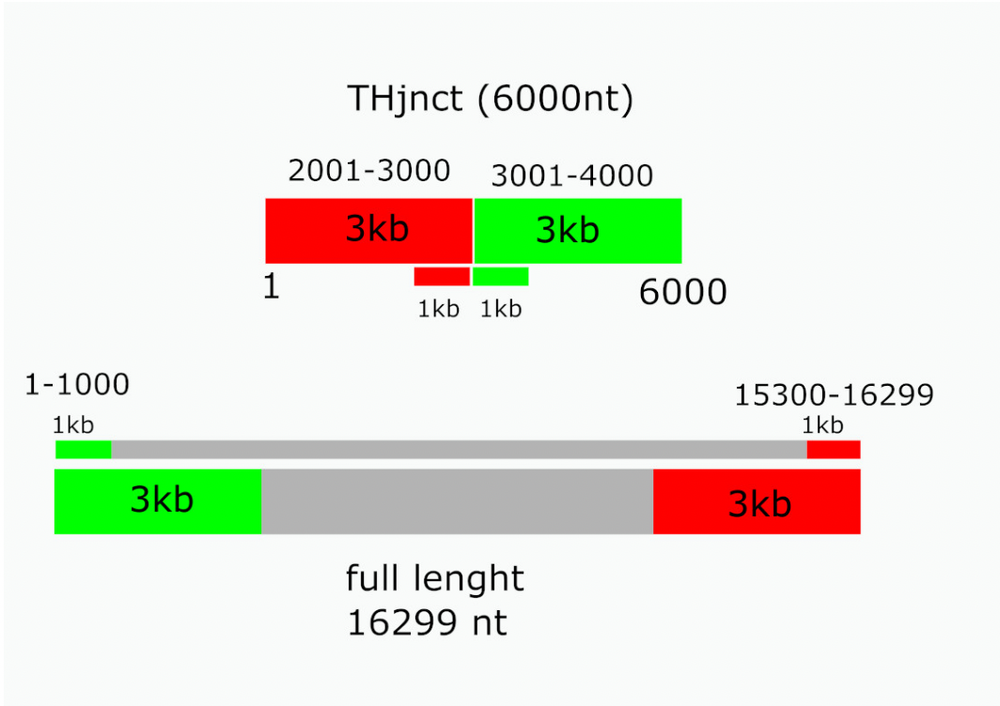

# FileName: mouse_variants

## Strategy for the identification of single nucleotide variants in the mouse mitochondrial genome

This document is supplementary to the article:
Alfredo Varela-Echavarría, Kenya L. Contreras-Ramírez, Carlos Lozano-Flores, and Maribel Hernández-Rosales (2024) Detection of single nucleotide variants in the mitochondrial genome of healthy mice and humans.

(Citation to be inserted here)

To map precisely the reads corresponding to the circular junction regions at the D-loop, tail-to-head junction sequences were made for the mouse mitochondrial genome by joining the 3kb of the end of the mm39 reference genome to 3kb of the start of the same sequence (THjnct)(Figure below). All reads from each sample were then aligned to the THjnct sequence and the full length linear sequence (FL). The example shown is for mouse and a similar strategy was employed for the human mitochondrial genome.



## Filtering mutect2 output of full length (FL) mapping:

This code parses and filters mutect2 output of FL mapping, selects single nucleotide events, inverts alleles if necessary to have major allele (MaA) counts in field 5 and minor allele (MiA) counts in field 6 adding the “i” sufix to both alleles in REF and ALT if inversion is made, eliminates strand bias both in MaA and MiA keeping only those in which strand ratios fall within the range 0.66-1.5, selects events in which MiA depth is at least 10 with at least five events on each strand, eliminates 1kb from each tail and head ends, and calculates allele frequency (MiA/MaA). Oneliners are separate so that progress can be verified at each step during test runs before batch runs are made.

```bash
zcat seqfile_FL.vcf.gz |\
grep ^chrM |\
awk '{print $2"\t"$4"\t"$5"\t"$10}' |\
awk -F':' '{print $1"\t"$2"\t"$4"\t"$7}' |\
grep '  0/1     ' |\
awk -F',' '{print $1"\t"$2"\t"$3"\t"$4"\t"$5}'|\
awk '{if ($5 < $6) print $1"\t"$3"i\t"$2"i\t"$4"\t"$6"\t"$5"\t"$7"\t"$10"\t"$11"\t"$8"\t"$9; else print $0}'|\
awk '($1>1000) && ($1<15300) && ($11 ? $10/$11<=1.5 : 0) && ($10 ? $11/$10<=1.5 : 0) && ($8/$9<=1.5) && ($9/$8<=1.5) && $10>=5 && $11 >=5 {print $0"\t"$6/$7}'> seqfile_FL.fltrd
```
Filtering mutect2 output of tail-to-head junction (THjnct) mapping:
This code parses and selects variants from mutect2 output of THjnct mapping as described for FL mapping. It also selects events that lie within the 1 kb at the tail and 1kb at the head of the genome also correcting the position to the full length genome.

```bash
zcat seqfile_TH.vcf.gz |\
grep ^chrM |\
awk '{print $2"\t"$4"\t"$5"\t"$10}' |\
awk -F':' '{print $1"\t"$2"\t"$4"\t"$7}' |\
grep '  0/1     ' |\
awk -F',' '{print $1"\t"$2"\t"$3"\t"$4"\t"$5}'|\
awk '{if ($5 < $6) print $1"\t"$3"i\t"$2"i\t"$4"\t"$6"\t"$5"\t"$7"\t"$10"\t"$11"\t"$8"\t"$9; else print $0}'|\
awk '($11 ? $10/$11<=1.5 : 0) && ($10 ? $11/$10<=1.5 : 0) && ($8/$9<=1.5) && ($9/$8<=1.5) && $10>=5 && $11 >=5 {print $0}' |\
awk '{if ($1>2000 && $1<3001) print $1+13299"\t"$2"\t"$3"\t"$4"\t"$5"\t"$6"\t"$7"\t"$8"\t"$9"\t"$10"\t"$11"\t"$6/$7; else if ($1>3000 && $1<4001) print $1-3000"\t"$2"\t"$3"\t"$4"\t"$5"\t"$6"\t"$7"\t"$8"\t"$9"\t"$10"\t"$11"\t"$6/$7}'> seqfile_TH.fltrd
```
